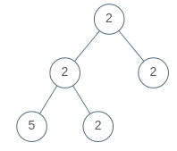

965. Univalued Binary Tree
Easy

228

37

Favorite

Share
A binary tree is univalued if every node in the tree has the same value.

Return true if and only if the given tree is univalued.

 

Example 1:


```
Input: [1,1,1,1,1,null,1]
Output: true
```


Example 2:



```
Input: [2,2,2,5,2]
Output: false
```

Note:

The number of nodes in the given tree will be in the range [1, 100].

Each node's value will be an integer in the range [0, 99].


## 方法

```go
/**
 * Definition for a binary tree node.
 * type TreeNode struct {
 *     Val int
 *     Left *TreeNode
 *     Right *TreeNode
 * }
 */
func isUnivalTree(root *TreeNode) bool {
    if root == nil {
		return true
	}

	if (root.Left != nil && root.Val != root.Left.Val) ||
		(root.Right != nil && root.Val != root.Right.Val) {
		return false
	}

	return isUnivalTree(root.Left) && isUnivalTree(root.Right)
}
```


```python
# Definition for a binary tree node.
# class TreeNode(object):
#     def __init__(self, x):
#         self.val = x
#         self.left = None
#         self.right = None

class Solution(object):
    def isUnivalTree(self, root):
        """
        :type root: TreeNode
        :rtype: bool
        """
        s = [root]
        while s:
            node = s.pop()
            if not node:
                continue
            if node.val != root.val:
                return False
            s.append(node.left)
            s.append(node.right)
        return True
```